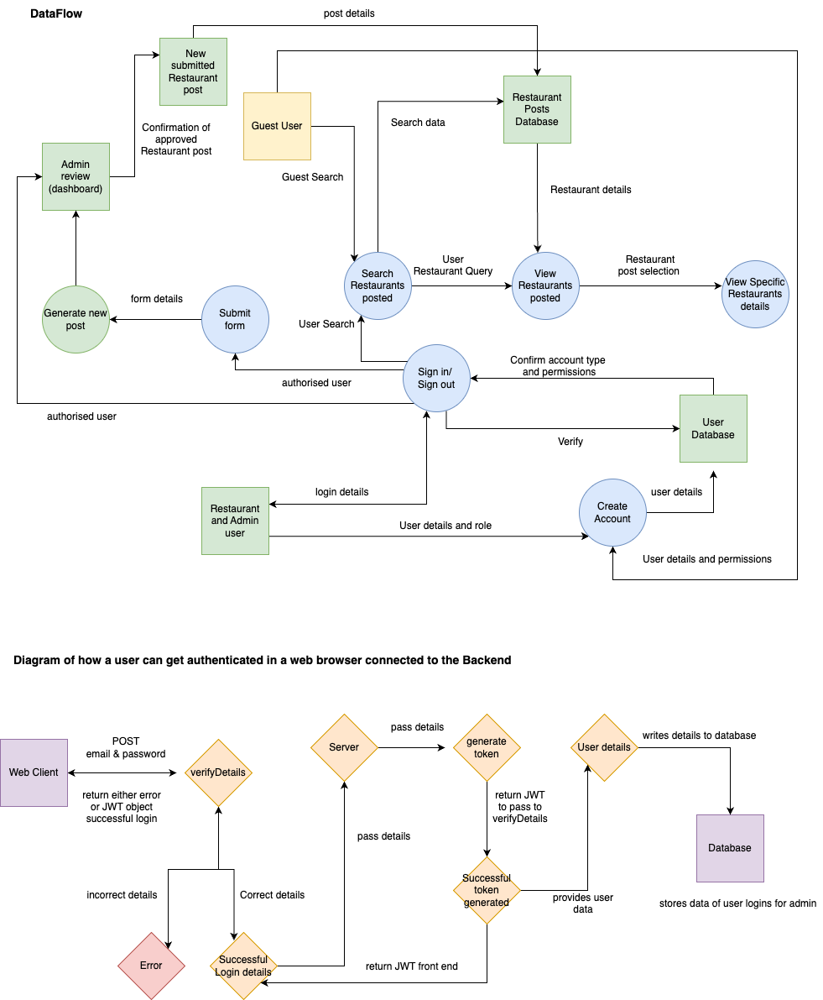

# Gluten-Free-Finder-Docs
## Megan Van Der Weide & Sofia-Bella Frugone
--- 
### Purpose
Our client desired a tool to help them take control and ease the challenges of eating out as a Gluten intolerance or Coeliac person. This tool is the Gluten Free Finder, a website to help them locate a gluten-free restaurant and reduce their stress of eating Gluten by accident. Our client told us their struggles of being debilitated by this allergy which cause them physical effects of hives, breathing difficulties and sickness of excrement and vomiting. In addition, their emotional effects of stress and anxiety of fear of cross-contamination when eating out with friends or in a new city and a lack of enthusiasm when trying a new cuisine. Our client told us that they felt like a burden or inconvenience to others from having to constantly control where and what they can eat.
 
With no place to manage our client's giant list of personally approved restaurants, our client saved all their recommendations in their notes on their iPhone. Whilst this worked fine, it caused room for error and a lack of desire to want to eat out of their comfort zone. Many hours have been wasted searching google, looking at menus and hoping that the restaurant didn’t cause violent gluten reactions. 

This is where the Gluten Free Finder comes in to resolve these challenges. Moving to a more streamlined practical management system, our client realised, in collaboration with us, that they could remove the guesswork, trial and error and suffering from eating something with Gluten when eating out. In addition, our client wants to provide this not-for-profit application to help others. Putting this application  out there to the world, our client can spread the word about excellent Gluten Free restaurants. There is no doubt that the Gluten Free Finder will become very popular among the Gluten intolerant people of this world. 

The importance of this application lies in real-world facts and statistics: 
- What is it?  A genetic condition resulting in intestinal damage whenever they ingest gluten, a protein found in wheat, barley, and rye.
- What happens? The immune system mistakenly thinks gluten proteins are foreign invaders and attacks them. [Reference](https://www.healthline.com/nutrition/gluten-sensitivity-is-real#gluten)
- Adverse reactions to gluten have been linked to numerous other conditions, including gluten ataxia (a type of cerebellar ataxia), Hashimoto’s thyroiditis, type 1 diabetes, autism, schizophrenia, and depression.
- Other Gluten effects: mental fatigue, also known as “brain fog”, fatigue, anemia, gas, bloating, abdominal pain, headache, chronic diarrhea, constipation, stomach pain, nausea and vomiting, failure to thrive in infants, delayed puberty in adolescents, short stature, irritability in mood, weight loss, dental enamel defects, osteoporosis, joint pain, canker sores inside the mouth, infertility or frequent miscarriages, missed menstrual periods, tingling in the hands and feet.
- Doctors often say ‘to avoid it’, but for some people, this involves meticulous care in not cross-contaminating. 
- Dr Fasano: Gluten Sensitivity May Affect 6% to 7%. Overall, that’s 20 million people in the United States alone could have the condition and one in every 133 people. (reference Jane Anderson is a medical journalist and an expert in celiac disease, gluten sensitivity, and the gluten-free diet. [Reference](https://www.verywellhealth.com/how-many-people-have-gluten-sensitivity-562965)

Our application Gluten Free Finder is a service connecting restaurants and customers. This web application aims to fulfil two purposes. Firstly the app provides trusted information for those seeking a Gluten Free restaurant. Secondly, the app will showcase and advertise the restaurants as a part of the service, that they care about their customers, take allergies seriously and provide safe food choices. 
 
The Gluten Free Finder is aimed to provide ease and convenience to its users by increasing their food safety. This application aims to give its users peace of mind that all restaurants on the website are carefully checked and approved by the Gluten Free Finder to provide its users with the most accurate information. This will be achieved with a highly secure dashboard managed by our moderator, who can approve the restaurant recommended to the app, including any Gluten free certificates directly from the restaurant. In addition, we have a secure login for any restaurant recommending their place to be posted.
 
Whilst other competitors provide a search application for finding food nearby, none specialise in the topic of gluten-free meals. We all feel better about ourselves when we know that we are helping others and when we can see our help in action with real people. Therefore the restaurants will not only gain more customers, but they will know that they are making a difference in this community. With growing popularity, it may even encourage more restaurants to offer a Gluten Free menu.

---

### Functionality/Features
Our app caters towards users in search of gluten-free friendly restaurants and restaurants that cater towards this dietary requirement. The application aims to appeal to the Coeliac association by utilising the Coeliac Australian colours of blue and green.We have identified three different roles required to launch and maintain the site. 

**General public (Users/Guests)**

All users who visit the site are not required to sign up in order to access search functionality. Our reasoning for this is that we want everyone to be able to search and use the site regardless of whether they sign up or not. The app has the capability to expand. 
- Sign up/Sign in
- View restaurants 
- Filter restaurants by cuisine and/or location 

**Restaurant (Owners/Managers)**

Restaurant and site admin will login via the same screen. When a restaurant user signs up they will see a button that allows them to create a post to upload to the site. All posts will need to be reviewed by the site admin in order to go live. Restaurant users will also have a dedicated screen that allows them to see the current status of their submission. 
- Sign up/Sign in
- Create a submission form 
- Upload supporting documents and images
- View submission status 

**Site Admin (Moderator)**

A site admins account cannot be created via the sign up screen and can only be assigned by the developers. When a site admin logs in they will see a dedicated dashboard that displays all pending, approved and denied submissions, from there they can view the post and either approve or deny. We also plan to implement a filter on the dashboard that allows them to filter by submission status. 
- Sign up/Sign in
- Dashboard overview
- Approve or deny submissions 
- Create submissions
- Filter by submission status 
---

### Target Audience  
This app is aimed at anyone around the world with or who has a friend or family member with Coeliac disease or an intolerance to Gluten. It aims to provide a trusted service for these people to locate a Gluten Free Restaurant. It strives to reduce the stress of eating with an allergy whilst providing them with a restaurant nearby that may fill their cuisine cravings. 

---

### Tech Stack 
**Front-end:** HTML, CSS, JavaScript, React, JSX, Style Framework TBD (Bootstrap, Tailwind or Material UI)

**Back-end:** Node, ExpressJS, Rails

**Database:** MongoDB

**Deployment:** Heroku

**Testing:** TBD (Jest)

**Project management:** Trello, Discord

**Design:** Figma, Canva, Draw.io

**DevOps:** Git, Github, VS code

---

### Dataflow Diagram

---

### Application Architecture

---

### User Stories

Who are our users?
As a User (Guest, Admin and Restaurant User)
 
**General public (Users/Guests)**

Guest refers to a consumer of the application who uses it to search Gluten Free Restaurants according to the restaurant's name, location and cuisine. 
 
**Site Admin (Moderator)**

Admin refers to the moderator of the application. This user approves or disapproves of a Gluten Free restaurant from the form to be added to the search. They use this application to provide a service to Guests searching and Restaurant users wanting their restaurants to be available to search. The admin can also search for restaurants similar to the Guest user. 
 
**Restaurant (Owners/Managers)**

Restaurant User refers to the application consumer who uses the website by submitting a form to request a restaurant in the search bar. They also can use this application to search for restaurants similar to the 
 
 **Gluten Free Finder User Stories:**
1. View restaurants - on homepage
   
- As a caring friend of a gluten intolerant person I want to visit the Gluten Free Finder to easily view gluten free restaurants on the homepage so I can browse the restaurants that the website has to offer and find a suitable place for our next catch up. 

- As an owner of a Restaurant I want to be able to view GF restaurant posts on the homepage so I can compare mine with other restaurants and understand what my restaurant needs to do to get onto the Gluten Free Finder.

- As an admin in charge of the website, I want to view restaurant posts on the home page so I can check that the website is working, looking aesthetically pleasing to visitors and that my posts are working correctly. 

2. Allow users to search restaurants
   
- As someone who is hungry and needs GF food, I would like to be able to easily find a restaurant near me by using the search function on Gluten Free Finder so I can find restaurant and be less hangry. 

3. Allow users to filter restaurants
   
- As an anxious Gluten intolerant person, I need to be able to filter restaurants by cuisine and location, so I can narrow down my results and find a restaurant quickly that meets my needs. 
  
- As a competitive business owner of a restaurant I want to be able to search restaurants by location and cuisine so I can see the competition nearby

4. View restaurants - after searching
   
- As a user utilising the search bar, I want to view restaurants after I can see restaurants more specific to me

5. View specific restaurants (AKA open card)
   
- As a celiac and gluten intolerant person, need specific criterias met to eat at the restaurant therefore I want to view more details about each restaurant such as their food preparation so I can determine if I want to visit this restaurant.
  
- As the 'perfectionist' moderator of Gluten Free Finder, I need to view each and every restaurants details posted so I can be sure that all customers questions are answered with these details. 
  
- As a protective restaurant owner, I need to view be able to view my specific restaurant post to ensure that all details are correct and up to date so I can be sure that my brand is represented correctly to people using the Gluten Free Finder to view it. 

6. Allow owners to create a restaurant account & 8. Show restaurant suggestion form
   
- As a busy restaurant owner, I would like to have a simple sign up feature, so I can easily create an account to access the form page and submit my restaurant for approval at speed so it doesn't take up my time away from the business. 

7. Allow users to sign in
   
- As a busy restaurant I need to be able to log in with saved details so that I can re-access the ability to submit a form in case I rush my original one and it didn’t get approved because of any missing details. 

 
8. Allow users to create and submit a form
   
- As a restaurant user, I would like to be involved with Gluten Free Finder to bring more customers to the restaurant. I would like to be able to create and submit my suggestion form, so I can submit my restaurant for approval and have my restaurant visible on the website. 
  
9. Error states for forms
    
- As a busy restaurant user, it’s important for me to know that my form was submitted successfully so that I can carry on with my day. I would like to see an error state if my form is unable to be submitted so that I can re-submit. 
  
10. Document upload for forms
    
- As a restaurant user, I would like to attach documents to my form, so I can upload any required documents and have a greater chance of the post being approved.
 
11. Allow admin to view a dedicated dashboard
    
- As an organised admin moderator, I’m a very visual person and would like to view a dedicated admin dashboard so that I can manage restaurant submissions and create them into new posts.
 
12.  Allow admin to review submitted forms

- As a moderator who wants to provide a trusted service to Gluten Free Intolerant people, I would like to review each submitted form so I can see what forms have been submitted by Restaurant users and approve or deny them to become posts on the Gluten Free Finder. This way my users will trust the service we are providing because they won’t be getting unwell at the restaurants.  
 

13.  Other user stories discovered through market research

- As someone who is debilitated by gluten, I will use a monitored site so I can implace my trust in the approved restaurants and eat and sleep knowing I won't get ill from these restaurant. I will then be a continious user who will recommend the Gluten Free Finder to friends and family. 
   
- As an admin user, I would like to create a restaurant post so I can post my own reccomendations and contribute to the Gluten Free Finder posts.
   
- As an organised admin user, I would like to delete submitted forms once they've been denied so I can move onto the next form to review.

- As the moderator, I need to have the control over approving or denying submitted forms for new Restaurant posts so that I can have a trusted application for my users. 

- As a signed up user who is often 'on the go' I sometimes forget my password, I want to be able to change my email or password, so that I have relevant personal information and can access the forms. 
  
- As an anxious user who likes control over their own details, I want to be able to remove my account so I can reduce my information stored in the website if I no longer want an active account.
  
---

## Wireframes

Wireframes can also be viewed on figma here: [Figma](https://www.figma.com/file/VObp0Nb4gK80DbtwUmfhKV/Gluten-Free-Finder?node-id=31%3A2)

**Mobile view:**

---

## Project Management
The project managment tool we've used to track our progress for this assesment is [Trello, which can be viewed here.](https://trello.com/b/g94algv7/t3a2-full-stack-app) We have 10 columns in our board, each of which contribute to an agile approach of product development.

1. **Blocked** Tasks which we are unable to continue with without further follow up. 
2. **Extras** Our nice-to-haves if time allows. 
3. **Need to discuss** Tasks which require more discussion.
4. **Coming Up** Tasks we will complete next sprint but need to look into before the sprint begins.
5. **To-do** Current sprint tasks.
6. **In progress** Tasks being worked on.
7. **Testing** Any tasks going through manual/user testing before being completed. 
8. **Done** Finished tasks!
9. **Questions** Similar to our discuss column however we added this board to help us visually.
10. **Resources** Any resources we want to keep during our development process. For quick reference.

 

 
 
